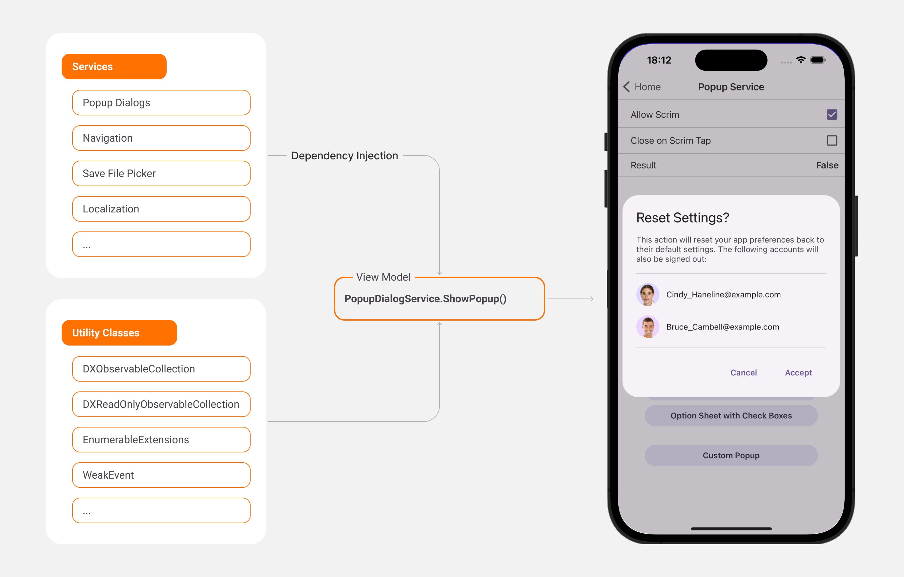

<!-- default badges list -->

<!-- default badges end -->

# DevExpress MVVM UI for .NET MAUI

The **DevExpress MAUI MVVM Library** ships as part of the [DevExpress .NET MAUI Mobile UI component suite](https://www.devexpress.com/maui/). 

Use the **DevExpress MAUI MVVM Library** to leverage MVVM design patterns in your next great MAUI application. Our MVVM library is based on the [.NET Community Toolkit](https://learn.microsoft.com/en-us/dotnet/communitytoolkit/). 

## Requirements

Register your DevExpress NuGet Feed within Visual Studio to restore packages used in this solution. Refer to the following article for additional information: [Get Started with DevExpress Mobile UI for .NET MAUI](https://docs.devexpress.com/MAUI/403249/get-started). 

Watch the following YouTube video to get started with DevExpress .NET MAUI controls: [Setting up a .NET MAUI Project](https://www.youtube.com/watch?v=juJvl5UicIQ).

## What's in This Repository

This repository demonstrates the following basic features available in the **DevExpress MAUI MVVM Library**: 
 
* [Dispatcher](./CS/Modules/DispatcherDemo/DispatcherDemoViewModel.cs/)
* [Navigation Service](./CS/Modules/NavigationServiceDemo/NavigationServiceDemoViewModel.cs/)
* [Popup Service](./CS/Modules/PopupService/PopupServiceDemoViewModel.cs/)
* [Validation](./CS/Modules/PopupService/LoginPopupViewModel.cs/)
* [Localization Service](./CS/Modules/LocalizationDemo/LocalizationDemoViewModel.cs/)
* [Print Service](./CS/Modules/PrintServiceDemo/PrintServiceDemoViewModel.cs/)
* [Save File Picker](./CS/Modules/SaveFilePickerDemo/SaveFilePickerDemoViewModel.cs/)
* [File Picker](./CS/Modules/FilePickerDemo/FilePickerDemoViewModel.cs/)
* [File System](./CS/Modules/FileSystemDemo/FileSystemDemoViewModel.cs/)
* [UI Service](./CS/Modules/UIServiceDemo/UIServiceDemoViewModel.cs/)
* [Dependency Injections](./CS/Modules/HomeModule/HomePage.xaml#L9) 

## Documentation

- [MVVM Library](https://docs.devexpress.com/MAUI/405291/mvvm/index)

## More Examples

* [Demo App](https://github.com/DevExpress-Examples/maui-demo-app)
* [Stocks App](https://github.com/DevExpress-Examples/maui-stocks-mini)
* [Data Form](https://github.com/DevExpress-Examples/maui-data-form-get-started)
* [Data Editors](https://github.com/DevExpress-Examples/maui-editors-get-started)
* [Data Grid](https://github.com/DevExpress-Examples/maui-data-grid)
* [Collection View](https://github.com/DevExpress-Examples/maui-collection-view)
* [Charts](https://github.com/DevExpress-Examples/maui-charts)
* [Scheduler](https://github.com/DevExpress-Examples/maui-scheduler-get-started)
* [Tab Page](https://github.com/DevExpress-Examples/maui-tab-page-get-started)
* [Tab View](https://github.com/DevExpress-Examples/maui-tab-view-get-started)
* [Drawer Page](https://github.com/DevExpress-Examples/maui-drawer-page-get-started)
* [Drawer View](https://github.com/DevExpress-Examples/maui-drawer-view-get-started)
* [Collection View](https://github.com/DevExpress-Examples/maui-collection-view-get-started)
* [Popup](https://github.com/DevExpress-Examples/maui-popup-get-started)
